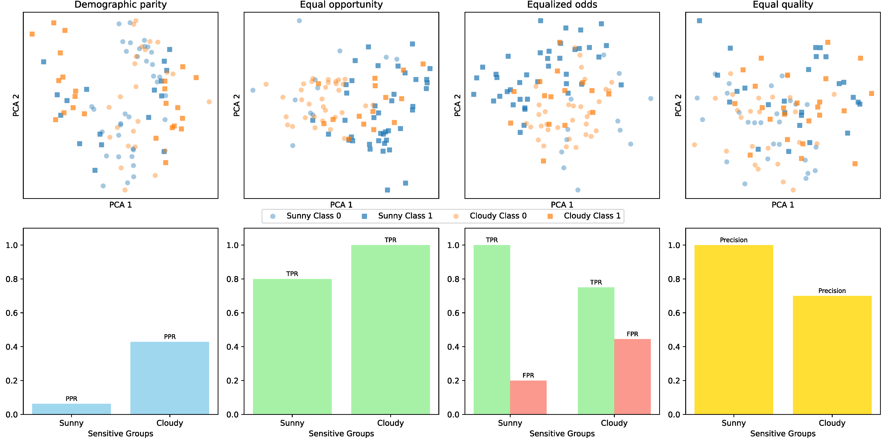
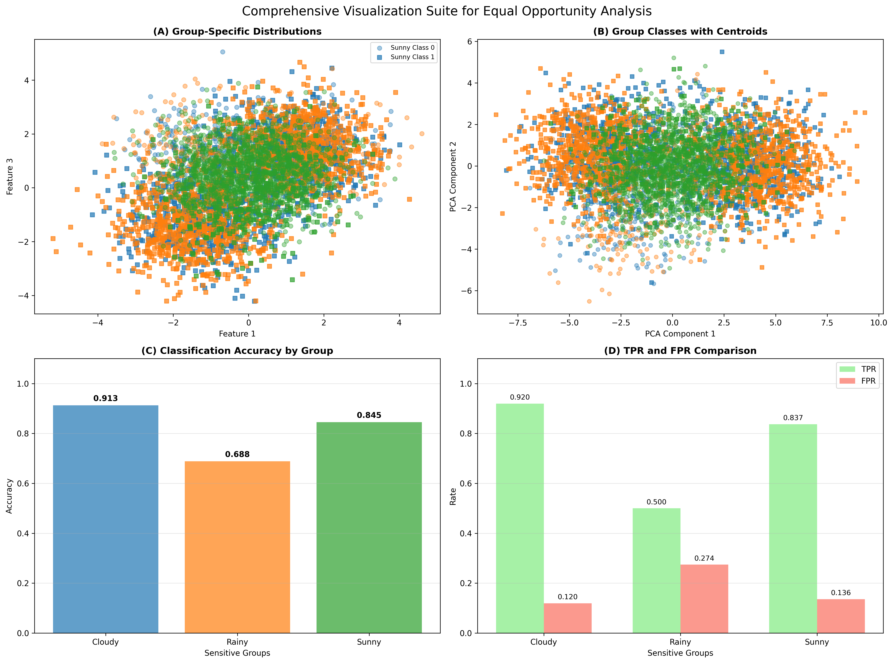

# Summary

*unfair-data-generator* is a Python library for generating classification datasets with controlled violations of common AI fairness criteria. The library requires Python 3.11+ and integrates with the standard data science stack including scikit-learn, NumPy, pandas, matplotlib, and fairlearn. Building upon scikit-learn's `make_classification()`[^1], it enables researchers to construct reproducible scenarios with known unfairness patterns across four key fairness criteria: demographic parity, equal opportunity, equalized odds, and equal quality. The library provides parameters to control sensitive group prevalence, class balance, disparity magnitude, and optional "leaky" features that correlate with sensitive group membership, simulating real-world scenarios where neutral attributes inadvertently reveal protected characteristics. It returns features, labels, and sensitive attributes with diagnostics to verify the intended unfairness, supporting benchmarking, teaching, and research where ground-truth unfairness is required.

# Overview

The library produces classification datasets that are fully compatible with the scikit-learn ecosystem, extending `make_classification()` with fairness-aware capabilities. Beyond standard controls for informative/redundant features, class balance, and noise, users specify a sensitive attribute with configurable group proportions and select from four key fairness criteria to violate: demographic parity, equal opportunity, equalized odds, and equal quality. A small set of parameters sets the magnitude of disparity, enabling researchers to create datasets with precisely controlled unfairness patterns for benchmarking and evaluation.

Optional leaky features can be generated that correlate with group membership, simulating common real-world scenarios where neutral attributes (such as ZIP codes, education history, or credit scores) inadvertently encode information about protected characteristics [@turini2008discrimination; @datta2017proxy]. These features create pathways for discriminatory outcomes even when sensitive attributes are not directly used in model training.

The library uses intuitive weather-based naming conventions (Sunny, Cloudy, Rainy, Windy, Stormy) for sensitive groups, supporting 2-5 groups per dataset (easily extendable to unlimited). These neutral weather terms avoid associations with existing societal biases, ensuring the generated datasets remain free from unintended connotations. The output includes feature matrix $X$, labels $y$, sensitive attribute $Z$, and diagnostic summaries of the achieved group-wise fairness violations, providing researchers with both the synthetic data and verification that intended unfairness patterns were successfully created.

\newpage

This controlled generation approach supports reproducible experiments where ground-truth unfairness is required, enabling rigorous evaluation of fairness-aware algorithms, systematic benchmarking studies, and educational applications where students can explore bias patterns with known characteristics.

# Statement of Need

Developing and validating fair machine learning algorithms requires datasets with known, controllable bias patterns. Real-world datasets rarely provide this control, as the presence and degree of unfairness are typically unknown and confounded with other factors [@fabris2022algorithmic]. This limitation makes evaluation of fairness-aware algorithms extremely challenging, as researchers cannot distinguish between algorithmic improvements and dataset-specific effects [@friedler2019comparative].

While existing fairness libraries such as fairlearn[^2] and AIF360[^3] [@mehrabi2021survey] provide excellent tools for bias detection and mitigation on existing datasets, they do not address the fundamental need for controlled experimental conditions. *unfair-data-generator* fills this gap by enabling researchers to generate synthetic datasets with precisely specified unfairness patterns, supporting the development and comparison of new classification models and algorithms designed to handle biased data. The library provides a reproducible foundation for ablation studies that isolate how different sources and magnitudes of disparity affect downstream model behavior.

# Architecture

The architecture follows scikit-learn library's design patterns while extending its functionality to address the controlled generation of unfair datasets. The code is organized into four main modules, each responsible for a distinct aspect of the workflow.

The central component is the dataset generation module, which extends scikit-learn's `make_classification()` with fairness-aware capabilities. By manipulating cluster centroids, class separations, and sample distributions, it generates synthetic datasets with intentional bias patterns across sensitive groups. The function preserves scikit-learn compatibility while adding fairness-specific parameters such as `fairness_type`, `n_sensitive_groups`, and `n_leaky`, and outputs feature matrices ($X$), target labels ($y$), and sensitive group assignments ($Z$).

Complementing the core functionality, the parameter configuration module automates the generation of parameters for various fairness scenarios, supporting four common criteria: Equal Quality, Demographic Parity, Equal Opportunity, and Equalized Odds. It provides utilities for hypercube construction, creation of leaky features, and intuitive weather-based naming conventions to enhance interpretability across 2-5 sensitive groups.

The model training and evaluation module integrate with scikit-learn's training pipeline while enabling assessment of model performance in fairness-sensitive settings. Its main function performs scikit-learn's standard `train_test_split()`, `fit()` and `predict()`, while computing both overall and group-specific metrics, including accuracy (precision on the sensitive group), True Positive Rate (TPR), False Positive Rate (FPR), and confusion matrix. This ensures that models trained on unfair datasets can be evaluated systematically while keeping the workflow consistent with scikit-learn's interface.

\newpage

The visualization component provides comprehensive plotting capabilities for fairness analysis, bridging dataset generation, parameter configuration, and model evaluation. It includes functions for sensitive group-specific scatter plots, combined visualizations with centroids, and fairness metric comparisons. The module supports customizable feature selection and automatic markers and color schemes for clear interpretation of sensitive groups.

## Usage and Fairness Types

### Fairness Criteria

Using standard notation where $y$ denotes true labels, $\hat{y}$ predicted labels, $Z$ the sensitive attribute, and $g$ specific values of $Z$, the library implements four key fairness criteria:

- **Demographic parity (DP)**  
Ensures different positive prediction rates across groups, formally $P(\hat{y}=1|Z=g)$ varies with $g$ [@calders2010three].

- **Equal opportunity (EO)**  
Creates differences in true positive rates across groups among positive cases, $P(\hat{y}=1|y=1,Z=g)$ varies with $g$ [@hardt2016equality].

- **Equalized odds (EOD)**  
Violates both TPR and FPR equality across groups, $P(\hat{y}=1|y,Z=g)$ varies with $g$ for $y \in \{0,1\}$ [@hardt2016equality].

- **Equal quality**  
Generates different precision values across groups, $P(y=1|\hat{y}=1,Z=g)$ varies with $g$ [@chouldechova2017fair].



\autoref{fig:fairness-scenarios} demonstrates four generated scenarios, with PCA-reduced feature visualizations above and corresponding fairness metrics below, illustrating how different unfairness patterns manifest in both data structure and model evaluation.

\newpage

### Basic Usage

The following examples show how to generate datasets for all four supported fairness types. Each call returns feature matrix $X$, labels $y$, and sensitive group assignments $Z$, corresponding to the patterns shown in \autoref{fig:fairness-scenarios}. The datasets are immediately ready for use with any scikit-learn compatible classifier.

```python
from unfair_data_generator.unfair_classification import (
  make_unfair_classification
)

# Generate datasets for all four fairness criteria
X_dp, y_dp, Z_dp = make_unfair_classification(
    fairness_type='Demographic parity', random_state=42)

X_eo, y_eo, Z_eo = make_unfair_classification(
    fairness_type='Equal opportunity', random_state=42)

X_eod, y_eod, Z_eod = make_unfair_classification(
    fairness_type='Equalized odds', random_state=42)

X_eq, y_eq, Z_eq = make_unfair_classification(
    fairness_type='Equal quality', random_state=42)
```

### Complete Workflow and Advanced Configuration

The following example demonstrates the complete research workflow from generation to evaluation, including advanced features like leaky features and comprehensive visualization.

```python
from unfair_data_generator.unfair_classification import (
  make_unfair_classification
)
from unfair_data_generator.util.model_trainer import (
  train_and_evaluate_model_with_classifier
)
from unfair_data_generator.util.visualizer import (
  visualize_groups_separately, visualize_group_classes,
  visualize_TPR_FPR_metrics, visualize_accuracy
)
from sklearn.model_selection import train_test_split
from sklearn.ensemble import RandomForestClassifier

# Generate complex scenario with leaky features and multiple groups
X, y, Z, centroids = make_unfair_classification(
    n_samples=5000, n_features=10, n_informative=3, n_leaky=2,
    n_sensitive_groups=3, fairness_type='Equal opportunity',
    random_state=42, return_sensitive_group_centroids=True)

# Split data maintaining group distributions
X_train, X_test, y_train, y_test, Z_train, Z_test = train_test_split(
    X, y, Z, test_size=0.3, stratify=Z, random_state=42)

# Train model and compute fairness metrics
model = RandomForestClassifier(random_state=42)
model.fit(X_train, y_train)
metrics = train_and_evaluate_model_with_classifier(X, y, Z, classifier=model)

# Comprehensive visualization suite
visualize_groups_separately(X, y, Z, feature1=X[:,0], feature2=X[:,2],
                           feature1_name='Feature 1', feature2_name='Feature 3')
visualize_group_classes(X, y, Z, centroids=centroids)
visualize_accuracy(metrics, 'Equal Opportunity Analysis')
visualize_TPR_FPR_metrics(metrics, 'Fairness Metrics Comparison')
```

This workflow integrates seamlessly with the scikit-learn ecosystem while demonstrating advanced features including leaky features, multiple sensitive groups, and comprehensive fairness evaluation capabilities.

The library provides a comprehensive visualization suite to analyze generated datasets and model performance.



\autoref{fig:comprehensive-visualization} demonstrates the complete visualization component available in the library. Panel (A) shows the output of `visualize_groups_separately()`, illustrating how sensitive attributes influence feature space structure in datasets with leaky features. Panel (B) displays `visualize_group_classes()` with PCA-reduced feature space showing the separation between groups and classes. Panel (C) presents `visualize_accuracy()` output, revealing systematic performance differences across sensitive groups that exemplify unfairness. Panel (D) shows `visualize_TPR_FPR_metrics()` results, highlighting how fairness violations manifest in both true positive and false positive rates across different sensitive groups.

# Acknowledgements

The authors acknowledge the financial support from the Slovenian Research and Innovation Agency (research core funding No. P2-0057).

[^1]: \url{https://scikit-learn.org}
[^2]: \url{https://fairlearn.org}
[^3]: \url{https://github.com/Trusted-AI/AIF360}

# References
